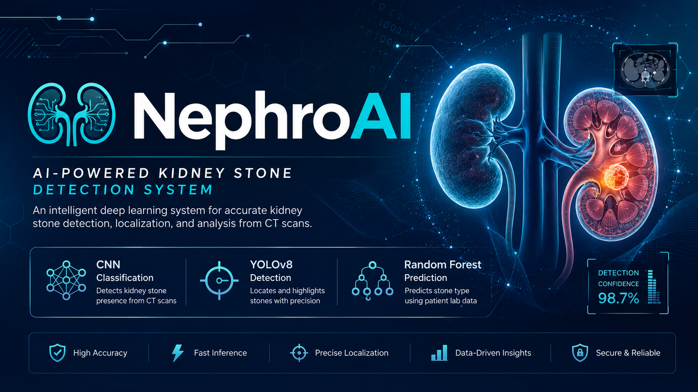
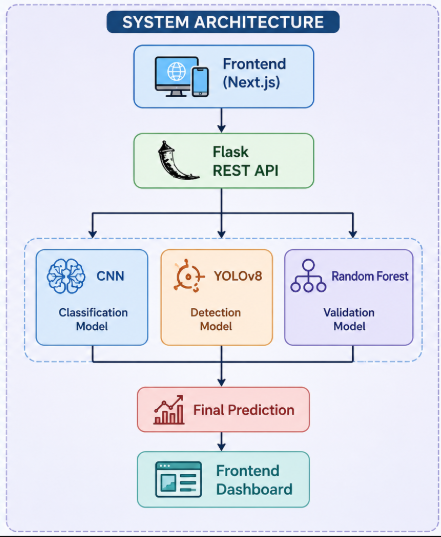
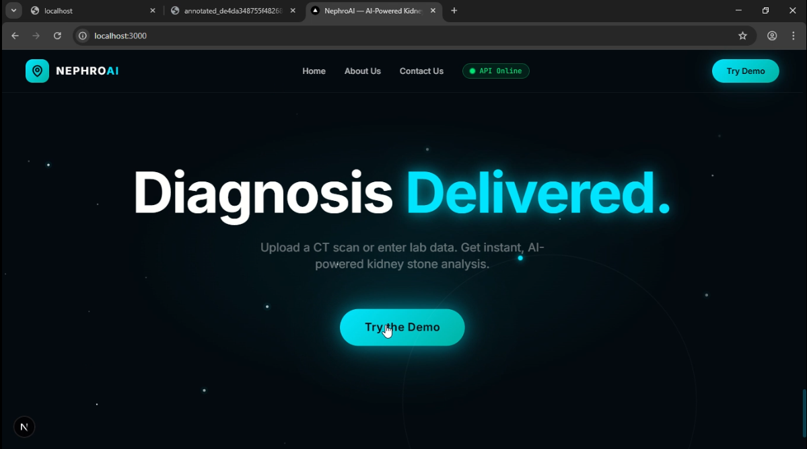
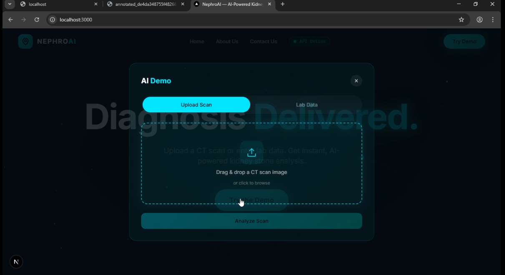

<p align="center">
  
</p>

<h1 align="center">NephroAI</h1>

<p align="center">
AI-Powered Kidney Stone Detection System using CNN, YOLOv8, Random Forest, Flask, and Next.js
</p>

<p align="center">
Medical Imaging • Computer Vision • Machine Learning • Healthcare AI
</p>

---

# 🚀 Project Overview

NephroAI is an AI-powered kidney stone detection system designed to assist healthcare professionals through intelligent medical image analysis and laboratory data validation.

The platform combines Deep Learning and Machine Learning to improve diagnostic reliability by integrating imaging-based predictions with clinical laboratory parameters.

The complete workflow includes CT scan analysis using a Convolutional Neural Network (CNN), precise kidney stone localization using YOLOv8, laboratory-based validation using a Random Forest classifier, and a modern web interface built with Next.js and Flask for real-time AI inference.

---

# ✨ Features

- AI-powered kidney stone detection
- CT scan image classification
- CNN-based prediction model
- YOLOv8 real-time stone localization
- Random Forest laboratory validation
- Annotated detection images
- Flask REST API backend
- Modern Next.js frontend
- Real-time AI inference
- Interactive medical dashboard
- Responsive user interface

---

# 🧠 AI Pipeline

<p align="center">
  
</p>

The AI pipeline follows a multi-stage diagnostic workflow:

1. The user uploads a CT scan image.
2. The CNN model predicts whether a kidney stone is present.
3. If a stone is detected, the image is forwarded to YOLOv8.
4. YOLOv8 localizes the stone and generates bounding boxes.
5. Laboratory parameters are analyzed using the Random Forest model.
6. Imaging and laboratory predictions are combined.
7. The final diagnosis, confidence score, probability, and annotated image are displayed on the frontend.

---

# 🏗️ System Architecture

<p align="center">
  
</p>

NephroAI follows a modular client-server architecture.

- Next.js provides the interactive frontend.
- Flask exposes REST APIs for AI inference.
- TensorFlow/Keras powers CNN classification.
- YOLOv8 performs object detection and localization.
- Random Forest validates predictions using laboratory data.
- Google Colab and ngrok enable cloud-hosted AI inference during development.

---

# 📁 Folder Structure

```text
NephroAI
│
├── frontend/
│   ├── app/
│   ├── components/
│   ├── lib/
│   ├── public/
│   └── package.json
│
├── backend/
│   ├── Kidney_Stone_API.ipynb
│   ├── requirements.txt
│   ├── uploads/
│   └── static/
│
├── assets/
│   ├── banner.png
│   ├── pipeline.png
│   ├── architecture.png
│   ├── landingpage.png
│   ├── upload.png
│   ├── detection.png
│   └── yolo.png
│
├── README.md
├── .gitignore
└── LICENSE
````

---

# 🛠 Tech Stack

## Frontend

* Next.js 15
* React
* TypeScript
* Tailwind CSS
* Axios

## Backend

* Python
* Flask
* REST API

## Artificial Intelligence

* TensorFlow / Keras
* Convolutional Neural Network (CNN)
* YOLOv8
* Random Forest
* OpenCV
* NumPy
* Pandas
* Scikit-learn

## Deployment

* Google Colab
* ngrok
* GitHub

---

# ⚙️ Installation

## Clone Repository

```bash
git clone https://github.com/chhassam2001-lang/NephroAI.git
cd NephroAI
```

## Install Backend

```bash
pip install -r requirements.txt
```

## Run Backend

Launch the Flask API from the Jupyter Notebook (`Kidney_Stone_API.ipynb`) or your Python backend environment.

## Install Frontend

```bash
cd frontend
npm install
npm run dev
```

The application will be available at:

```
http://localhost:3000
```

---

# 🔌 API Endpoints

## Health Check

```http
GET /
```

Returns backend status.

---

## Image Prediction

```http
POST /predict
```

### Input

* CT Scan Image (`multipart/form-data`)

### Output

* Prediction
* Confidence Score
* Stone Probability
* YOLO Detection
* Annotated Image

---

## Laboratory Prediction

```http
POST /predict-lab
```

### Input

* Age
* Creatinine
* Calcium
* Uric Acid
* pH

### Output

* Prediction
* Confidence Score
* Stone Probability

---

# 📸 Screenshots

## 🏠 Landing Page

<p align="center">

</p>

---

## 📤 CT Scan Upload

<p align="center">

</p>

---

## 🔍 Detection Result

<p align="center">

</p>

---

## 🎯 YOLOv8 Detection

<p align="center">

</p>

---

# 🎯 Results

* Accurate kidney stone classification using CNN.
* Real-time kidney stone localization using YOLOv8.
* Laboratory validation using Random Forest.
* End-to-end AI diagnostic workflow.
* Interactive web application.
* Fast inference through Flask REST APIs.

---

# 🚀 Future Improvements

* Cloud deployment
* Docker support
* Kubernetes deployment
* User authentication
* PACS integration
* Multi-disease kidney diagnosis
* Explainable AI (Grad-CAM)
* Doctor dashboard
* PDF report generation
* Mobile application

---

# 📬 Contact

**GitHub**

https://github.com/chhassam2001-lang

---

# ⭐ Support

If you found this project helpful, consider giving it a ⭐ on GitHub.

Your support helps the project reach more developers, researchers, and healthcare innovators.


